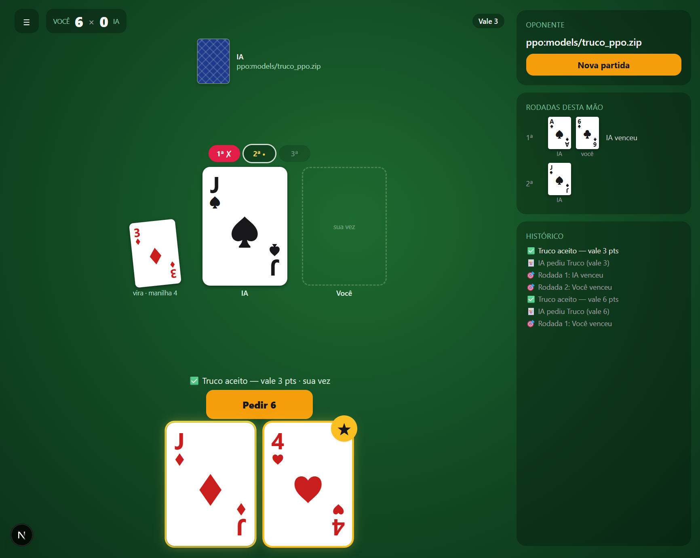
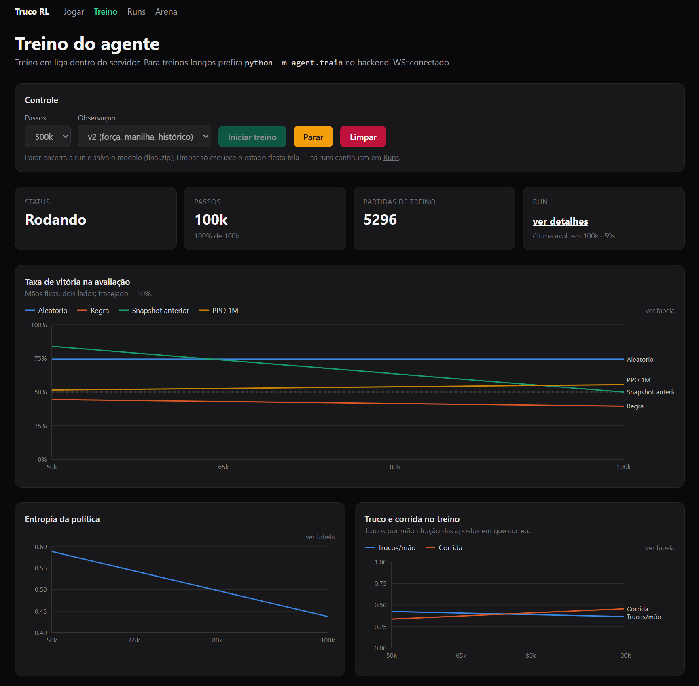
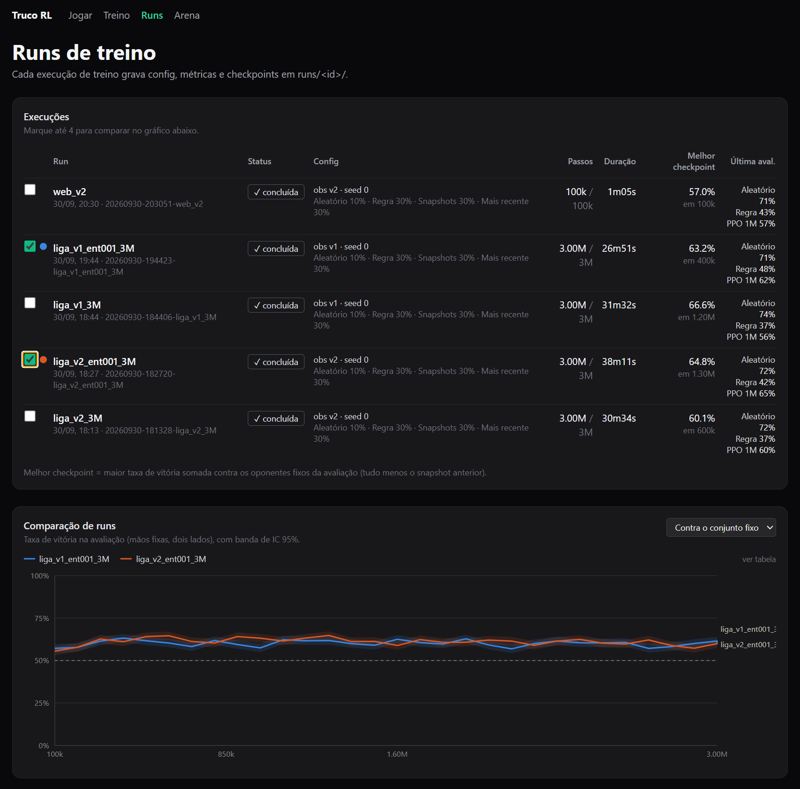
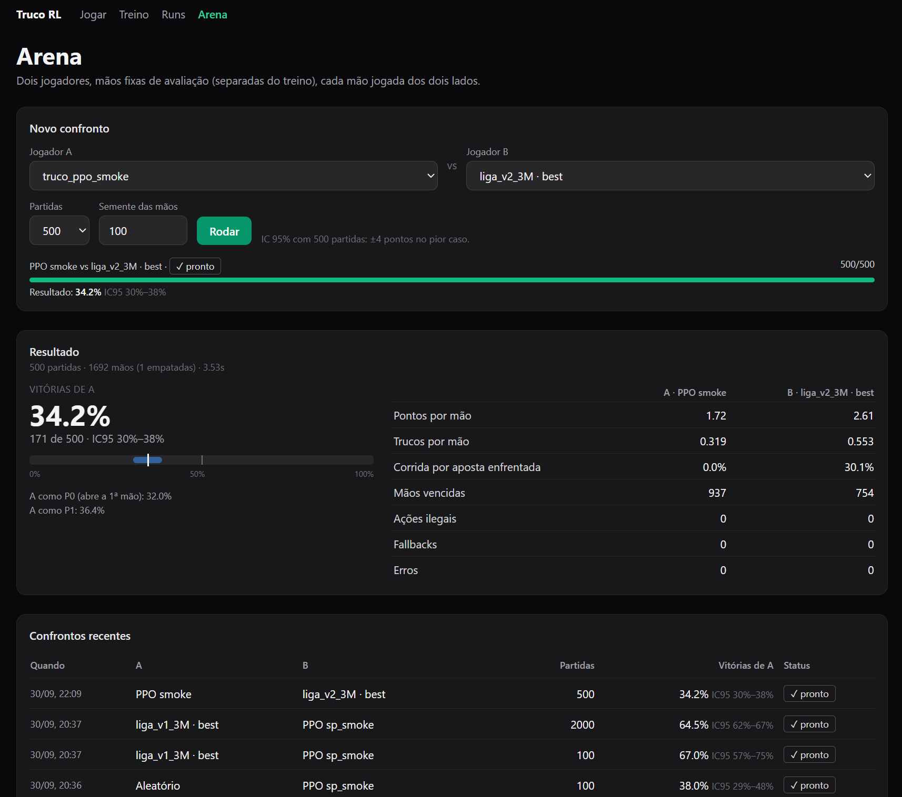

# 🃏 Truco de Malandro

> *"TRUCO, ladrão!"* — uma IA que aprendeu a blefar sozinha, na base da porrada.

<p align="center">
  
  
  
  
  
  <br>
  
  
  
  
  
  
</p>

<p align="center">
  
</p>

Senta, embaralha e se prepara: aqui o adversário é um agente de **aprendizado por reforço** que joga **Truco Paulista** *heads-up* (1 vs 1). Ele foi criado com **MaskablePPO** (só tenta jogadas legais, nada de esconder carta na manga), treinado numa **liga de oponentes** que inclui versões antigas dele mesmo, testado numa **arena** com intervalo de confiança e servido por API REST + WebSocket.

No frontend dá pra ver o bicho aprendendo, botar modelos pra se enfrentarem e, claro, sentar na mesa e tomar um truco na cara.

---

## 🎴 O que tem na mesa

| Funcionalidade | Descrição |
|---|---|
| Motor de regras | Truco Paulista com baralho de 40 cartas, manilhas, escadinha 1→3→6→9→12, mão de 11 e mão de ferro |
| Ambientes Gymnasium | `TrucoEnv` (P0 contra aleatório) e `LeagueEnv` (liga); ação `Discrete(7)` com máscara; recompensa ±1 no fim da partida |
| Observação única | `observe(game, player, version)` usada por env, treino, API e arena; versões `v1` (24 floats) e `v2` (174 floats) |
| Treino em liga | Oponente sorteado a cada partida entre aleatório, regra, snapshots anteriores e o mais recente, com pesos configuráveis |
| Arena | Partidas offline entre quaisquer dois jogadores, cada mão jogada dos dois lados, IC de Wilson, log JSONL por decisão |
| Runs persistidas | `runs/<id>/` com config, semente, commit, hiperparâmetros, métricas e checkpoints |
| API REST | Jogo (com oponente configurável), treino, runs e jobs de arena |
| Frontend Next.js | Runs e comparação, gráficos por run, matriz de confrontos, arena, tabuleiro humano vs IA |

---

## 🗂️ Onde fica cada carta

```
truco-de-malandro/
├── backend/
│   ├── main.py                 # FastAPI (CORS, rotas, /health)
│   ├── requirements.txt        # Dependências de produção
│   ├── requirements-dev.txt    # + pytest/httpx
│   ├── pytest.ini
│   ├── truco/
│   │   ├── game.py             # Motor de regras puro (TrucoGame)
│   │   ├── encoding.py         # Cartas <-> ids, ações 0..6, máscara, fallback legal
│   │   ├── obs.py              # observe(game, player, version): v1 e v2
│   │   ├── seeds.py            # Espaços de semente disjuntos (treino x avaliação)
│   │   └── env.py              # TrucoEnv (Gymnasium)
│   ├── agent/
│   │   ├── config.py           # HYPERPARAMS e TrainConfig (fonte única)
│   │   ├── league.py           # LeagueEnv e pool de oponentes
│   │   └── train.py            # python -m agent.train (runs/<id>/)
│   ├── arena/
│   │   ├── players.py          # ArenaPlayer, RandomPlayer, RulePlayer, PPOPlayer, registro de specs
│   │   ├── match.py            # Uma partida + estatísticas + log
│   │   ├── runner.py           # Confronto paralelo, cada mão dos dois lados
│   │   ├── stats.py            # IC de Wilson e resumo
│   │   ├── run.py              # CLI: python -m arena.run
│   │   └── tournament.py       # CLI: checkpoints x oponentes
│   ├── api/
│   │   ├── routes.py           # /game/*, /train/*, /ws/metrics
│   │   ├── runs.py             # /runs/*
│   │   ├── arena_jobs.py       # /arena/*
│   │   └── players.py          # Níveis e validação das referências de jogador
│   ├── models/                 # Checkpoints publicados (truco_liga_v2.zip é o de produção)
│   └── tests/                  # pytest
├── docs/images/                # Screenshots deste README
└── frontend/
    ├── app/                    # /, /play, /watch, /runs, /runs/[id], /arena
    ├── components/             # ui.tsx, charts.tsx, arena.tsx, game/
    ├── lib/                    # api.ts, format.ts, elo.ts
    ├── types/                  # game.ts, runs.ts
    └── hooks/useTrucoSounds.ts
```

---

## 📜 Regras da casa

Truco Paulista raiz, do jeito que se joga no boteco (só que sem cerveja derramada no baralho):

- **Força das cartas** (sem manilha): 3 > 2 > A > K > J > Q > 7 > 6 > 5 > 4.
- **Manilha**: o rank seguinte à vira na ordem cíclica 4,5,6,7,Q,J,K,A,2,3; entre manilhas vale o naipe (Paus > Copas > Espadas > Ouros). Sim, o zap continua sendo o rei da mesa.
- **Apostas**: 1 → 3 → 6 → 9 → 12. Quem pede truco não pode aumentar de novo até o adversário aumentar. Correr dá ao outro o valor anterior ao pedido. Não se pode pedir um valor que ultrapasse o necessário para fechar a partida.
- **Empates de rodada** (a famosa "cangou"): empate na 1ª → quem ganhar a próxima rodada decidida leva a mão. Vitória na 1ª e empate depois → leva quem ganhou a 1ª. Três empates → ninguém pontua.
- **Mão de 11**: quando só um jogador tem 11, ele olha as próprias cartas e decide antes de jogar: aceita (a mão vale 3) ou corre (o adversário ganha 1). Ninguém vê as cartas do outro e não há truco nessa mão.
- **Mão de ferro** (ambos com 11): vale 3 pontos, sem truco. Regra da casa: a interface esconde as cartas do humano, mas a IA vê as dela. A casa sempre leva vantagem. 😏

---

## 👀 O que a IA enxerga (`truco/obs.py`)

`observe(game, player, version)` é a única função que monta a visão de um jogador e **nunca** inclui as cartas escondidas do adversário. Tem teste garantindo: aqui ninguém espia a mão alheia.

- **v1** (24 floats): layout original, com cada carta como um escalar `(id+1)/40`. É a versão dos checkpoints `truco_ppo_*`.
- **v2** (174 floats): cada carta da mão com rank e naipe em one-hot, força relativa à vira e flag de manilha. Inclui ainda a vira e o rank da manilha; a mesa (quem jogou, força, manilha); o resultado de cada rodada; a rodada atual e a carta a bater; as 40 cartas já vistas; o placar; a aposta atual e a pendente em one-hot; flags de mão de 11, mão de ferro, turno, pé, se pode aumentar e se fez o pedido pendente; e as cartas restantes de cada lado.

O `PPOPlayer` detecta a versão pelo tamanho da entrada do modelo, então checkpoints v1 e v2 sentam na mesma mesa, na arena e na API.

---

## 🏋️ Treino: a escolinha do malandro

<p align="center">
  
</p>

### Hiperparâmetros

Ficam num único dict, `HYPERPARAMS` em [`backend/agent/config.py`](backend/agent/config.py). Cada run grava os valores efetivos em `runs/<id>/config.json`. Um rollout junta `n_envs × n_steps` = 8 × 256 = 2048 transições (cerca de 110 partidas), com `batch_size=128` e `ent_coef=0.01`. O `truco_ppo_1M` foi treinado com a configuração antiga (`n_steps=512`, `batch_size=32`, um env, só contra o aleatório), que continua gravada dentro do zip.

### Treino em liga

Jogar só contra quem joga carta aleatória não forma malandro nenhum. Por isso, a cada partida o `LeagueEnv` sorteia o oponente conforme `DEFAULT_LEAGUE` (aleatório, regra, um snapshot anterior, pesos mais recentes), e o aprendiz joga em um lado sorteado. Snapshots são salvos a cada `snapshot_every` passos e entram no pool: a IA passa a apanhar das versões antigas dela mesma até aprender.

A cada `eval_every` passos, o checkpoint é avaliado na arena com 500 partidas contra cada oponente fixo (aleatório, regra, o snapshot anterior e o `truco_ppo_1M`). As mãos vêm do espaço de avaliação, disjunto do de treino, e cada uma é jogada dos dois lados. As avaliações rodam em processos separados.

```bash
cd backend
python -m agent.train --name liga_v2 --steps 3000000 --obs v2 --seed 0
# variações
python -m agent.train --name liga_v1 --obs v1
python -m agent.train --league random=0.2,rule=0.4,snapshot=0.2,latest=0.2
python -m agent.train --hp ent_coef=0.01 --hp learning_rate=0.0001
python -m agent.train --help
```

Com 8 envs, o treino faz cerca de 2 000 passos/s numa CPU de desktop, avaliações incluídas. 3M de passos levam uns 30 minutos: dá tempo de jogar umas mãos enquanto isso.

### Runs

<p align="center">
  
</p>

Cada execução cria `runs/<data>-<nome>/`:

| Arquivo | Conteúdo |
|---|---|
| `config.json` | TrainConfig completo, semente, commit do git (e se havia alterações locais), versões das bibliotecas |
| `run.json` | status, passos, melhor checkpoint |
| `metrics.jsonl` | uma linha por avaliação: estatísticas de treino (vitórias por tipo de oponente, recompensa, entropia, truco, corrida, KL…) e resultado da arena por oponente com IC 95% |
| `checkpoints/step_*.zip` | snapshots (também o pool da liga) |
| `best.zip`, `final.zip`, `latest.zip` | melhor pela avaliação, último, pesos do oponente "mais recente" |

O modelo de produção, `models/truco_liga_v2.zip`, é o `best.zip` da run `liga_v2_ent001_3M` (observação v2, `ent_coef=0.01`, melhor checkpoint em 1,3M passos). Para publicar outro, copie o zip para `backend/models/`: ele aparece no seletor de oponente. Para trocar o default, altere `LEVELS["impossivel"]` em `backend/api/players.py`.

---

## ⚔️ Arena: quem é o malandro de verdade?

<p align="center">
  
</p>

Coloca dois jogadores frente a frente, offline, e deixa a estatística decidir. Cada semente de avaliação é jogada duas vezes, trocando os lados (nada de culpar a sorte das cartas), em processos paralelos, e o resultado não depende do número de workers.

```bash
cd backend
python -m arena.run --a ppo:models/truco_ppo_1M.zip --b random --games 1000 --seed 123
python -m arena.run --a ppo:runs/<id>/best.zip --b ppo:truco_ppo_1M --games 2000
python -m arena.tournament --games 500                    # todos os models/*.zip x random, rule
python -m arena.tournament --checkpoints "runs/<id>/checkpoints/*.zip" --opponents random rule ppo:truco_ppo_1M
```

Saída: taxa de vitória de A com IC de Wilson, vitória por lado, pontos por mão, trucos por mão, fração de corridas por aposta enfrentada, ações ilegais, fallbacks e erros. Os arquivos `summary.json` e `decisions.jsonl` (estado, ação e resultado da mão de cada decisão) ficam em `arena_results/`.

### Os jogadores (specs)

| Spec | Jogador |
|---|---|
| `random` | O pato: uniforme sobre as ações legais |
| `rule` | O tio do boteco: joga a maior carta com mão boa, pede truco com mão muito boa, corre de aposta com mão fraca |
| `ppo:<caminho ou nome>` | Checkpoint MaskablePPO, com argmax (`ppo:truco_ppo_1M` = `models/truco_ppo_1M.zip`) |
| `ppo-stoch:<…>` | Mesmo checkpoint, amostrando a ação |
| `py:<módulo>:<Classe>[:arg]` | Qualquer classe importável (só pela CLI, nunca pela API) |

### Chamando um jogador novo pra mesa (ex.: Jev)

Um jogador precisa de `name` e `decide(game, seat) -> int` (0–6). A arena conta ações ilegais e usa a primeira legal como fallback. `reset(match_key)` é opcional.

```python
# backend/jev_player.py
from arena.players import ArenaPlayer
from truco.encoding import legal_action_ids

class JevPlayer(ArenaPlayer):
    name = "jev"
    def __init__(self, endpoint: str = "http://localhost:9000"):
        self.endpoint = endpoint
    def decide(self, game, seat) -> int:
        legal = legal_action_ids(game, seat)
        ...  # consultar o modelo externo; usar só as cartas do próprio seat
        return legal[0]
```

```bash
python -m arena.run --a py:jev_player:JevPlayer --b ppo:truco_ppo_1M --games 1000
```

Para que a API e o frontend também o aceitem, registre um prefixo com `register_player("jev", lambda arg: JevPlayer(arg))` e libere-o em `resolve_spec` (`backend/api/players.py`).

### Controles de sanidade (testes)

Estão em `tests/test_arena.py`: aleatório contra aleatório fica perto de 50%, regra contra regra e PPO contra ela mesma dão exatamente 50% (políticas determinísticas com troca de lado), a regra vence o aleatório, e o resultado em série é igual ao paralelo. Baralho viciado não passa.

---

## 🔌 API (`http://localhost:8000`)

### Jogo

| Método | Endpoint | Descrição |
|---|---|---|
| `POST` | `/game/new` | `{ opponent? }`: nível (`facil` = aleatório, `medio` = regra, `dificil` = `truco_ppo_1M`, `impossivel` = `truco_liga_v2`), `random`, `rule` ou `ppo:models/<zip>` / `ppo:runs/<id>/<zip>`; default `impossivel` |
| `POST` | `/game/action` | `{ game_id, action: 0–6 }`; executa a ação do humano e os turnos da IA |
| `GET` | `/game/state?game_id=` | Estado atual. Inclui `opponent`, `stats` (trucos, aumentos, aceites e corridas por lado) e `p1_cards_left`. As cartas da IA nunca são enviadas |
| `POST` | `/game/continue` | Com `ai_pending=true` (uma rodada fechou e a IA abre a próxima), faz a IA jogar; o frontend chama após 3 s para a rodada encerrada ficar visível na mesa |
| `POST` | `/game/next-hand` | Avança após `hand_ending=true` |
| `GET` | `/health` | Health check |

### Treino, runs e arena

| Método | Endpoint | Descrição |
|---|---|---|
| `POST` | `/train/start` | Treino em liga numa thread do servidor: `{ total_timesteps, name, obs_version, league?, eval_every, eval_games, init_from_run? }` |
| `POST` | `/train/pause` | Encerra a run (status `stopped`, salva `final.zip`) |
| `POST` | `/train/reset` | Encerra e limpa o estado em memória (as runs em disco ficam) |
| `GET` | `/train/status` | `running`, `run_id`, `timestep`, `latest_metric` (formato antigo) e `latest` (métrica completa) |
| `WS` | `/ws/metrics` | Métricas e status a cada 2 s |
| `GET` | `/runs` | Runs com config, duração, passos, melhor checkpoint e última avaliação |
| `GET` | `/runs/{id}` · `/metrics?since=N` · `/checkpoints` · `/matrix` | Detalhes, métricas, checkpoints e matriz checkpoints × oponentes |
| `GET` | `/arena/players` | Jogadores aceitos (níveis, `models/`, runs) |
| `POST` | `/arena/jobs` | `{ a, b, games, seed, run_id? }`: enfileira um confronto (processos separados) |
| `GET` | `/arena/jobs`, `/arena/jobs/{id}` | Progresso e resultado; com `run_id`, o resultado entra na matriz da run |

### Ações

| ID | Nome | Quando |
|---|---|---|
| 0–2 | Jogar a carta 0/1/2 | Turno de jogo |
| 3 | Pedir truco ("TRUCO!") | Sem aposta pendente e sem trava |
| 4 | Aceitar ("Cai dentro!") | Aposta pendente ou decisão da mão de 11 |
| 5 | Correr ("Corri…") | Aposta pendente ou decisão da mão de 11 |
| 6 | Aumentar ("SEIS, marreco!") | Aposta pendente com próximo valor disponível |

---

## 🖥️ Frontend

- **`/play`**: a mesa. Escolha o oponente (do pato ao `impossivel`), jogue, peça truco, corra se tiver juízo, e veja o resumo de trucos e corridas no fim da partida.
- **`/watch`**: inicia, para e acompanha um treino dentro do servidor, com os gráficos atualizando ao vivo.
- **`/runs`**: execuções com config, duração, passos, melhor checkpoint e última avaliação. Marque até 4 para comparar no mesmo gráfico, contra o conjunto fixo ou um oponente específico.
- **`/runs/[id]`**: o raio-x de uma run:
  - taxa de vitória por oponente com banda de IC;
  - treino × avaliação (recompensa ou vitória contra um mesmo oponente), com aviso quando divergem;
  - entropia, taxa de truco e taxa de corrida;
  - força por passo (conjunto fixo e Elo ajustado com o aleatório em 0);
  - matriz de confrontos, com um botão para avaliar qualquer checkpoint contra outro oponente.
- **`/arena`**: escolha dois jogadores, o número de partidas e a semente. Acompanhe o progresso e veja o resultado com IC e as estatísticas por lado.

---

## 🚀 Bora jogar: rodando localmente

### Backend

```bash
cd backend
python -m venv .venv
.venv/Scripts/activate            # Windows (Linux/macOS: source .venv/bin/activate)
pip install -r requirements-dev.txt
uvicorn main:app --reload
python -m pytest                  # testes
```

O `requirements.txt` fixa `torch==2.7.0+cpu`, que só tem wheels até Python 3.13. Em Python 3.14, instale o torch CPU mais recente antes (`pip install torch --index-url https://download.pytorch.org/whl/cpu`) e depois as demais dependências.

### Frontend

```bash
cd frontend
echo NEXT_PUBLIC_API_URL=http://localhost:8000 > .env.local
npm install
npm run dev
```

Abra http://localhost:3000, escolha o oponente e boa sorte. Você vai precisar.

---

## ⚙️ Variáveis de ambiente

| Serviço | Variável | Default | Para quê |
|---|---|---|---|
| backend | `PORT` | injetada pelo Railway | Porta do uvicorn |
| backend | `TRUCO_RUNS_DIR` | `backend/runs` | Onde ficam as runs; aponte para um volume persistente em produção |
| backend | `TRUCO_ARENA_DIR` | `backend/arena_results` | Resultados da arena e dos jobs da API; idem |
| backend | `TRUCO_ARENA_WORKERS` | `2` | Processos usados pelos jobs de arena e pelas avaliações do treino via API |
| frontend | `NEXT_PUBLIC_API_URL` | `http://localhost:8000` | URL pública do backend (embutida no build) |

---

## ☁️ Deploy no Railway

Dois serviços a partir do mesmo repositório, cada um com seu `railway.toml` e `Procfile`:

1. **Backend**: Root Directory = `backend`. O health check é `/health`. Sem volume, `runs/` e `arena_results/` somem a cada deploy. Para mantê-los, crie um volume (ex.: montado em `/data`) e defina `TRUCO_RUNS_DIR=/data/runs` e `TRUCO_ARENA_DIR=/data/arena_results`.
2. **Frontend**: Root Directory = `frontend`, com `NEXT_PUBLIC_API_URL` apontando para o backend. É preciso fazer redeploy se a URL mudar.

Observações:
- Faça o deploy de backend e frontend juntos. O payload de `/game/*` mudou (`mao11_player` no lugar de `open_hand_for`, sem `p1_hand`).
- O treino via `/train/start` roda numa thread do servidor e disputa CPU com o jogo. Para treinos longos, rode `python -m agent.train` localmente e publique o zip em `models/`.
- As partidas ficam em memória: reiniciar o serviço descarta as partidas em andamento.

---

## 🏆 Placar da arena

Taxa de vitória do jogador da linha, com IC 95%. Os números usam 1000 partidas por confronto e `--seed 777`: mãos diferentes das usadas para escolher o `best.zip` de cada run (semente 123), para não inflar o resultado. Cada mão é jogada dos dois lados. As runs de liga têm 3M passos e semente 0; o checkpoint é o `best.zip` de cada uma.

| Jogador | vs Aleatório | vs Regra | vs PPO 1M | vs liga v1 | vs liga v2 ent 0.01 |
|---|---|---|---|---|---|
| Regra | 83,5%¹ | — | 75,8% [73–78] | — | — |
| PPO 1M (modelo anterior, v1, só contra aleatório) | 66,1% [63–69] | 24,2% [22–27] | 50% | 35,9% [33–39] | 33,0% [30–36] |
| liga v1 (`ent_coef=0.05`), best em 1,2M | 67,8% [65–71] | **61,2%** [58–64] | 64,1% [61–67] | 50% | 42,0% [39–45] |
| liga v2 (`ent_coef=0.05`), best em 600k | 69,8% [67–73] | 39,1% [36–42] | 60,5% [57–63] | 52,5% [49–56] | 46,1% [43–49] |
| liga v2 (`ent_coef=0.01`), best em 1,3M = **`truco_liga_v2` (produção)** | **76,5%** [74–79] | 48,9% [46–52] | **67,0%** [64–70] | **58,0%** [55–61] | 50% |
| liga v1 (`ent_coef=0.01`), best em 400k | 67,5% [65–70] | 56,7% [54–60] | 60,3% [57–63] | 43,2% [40–46] | 41,5% [38–45] |

¹ `--seed 123`.

Leitura:
- A correção da semente mais o treino em liga levam todos os modelos novos acima do PPO 1M, com folga contra a regra (de 24% para 39–61%).
- Com `ent_coef=0.05`, a entropia fica perto de 0,7 durante todo o treino e o desempenho estaciona cedo. Com `0.01`, a v2 é a mais forte no geral: vence o PPO 1M, a liga v1 e o aleatório com margem.
- Com `ent_coef=0.01` nos dois, a observação v2 vence a v1 no confronto direto (58,5%). Baixar a entropia ajudou a v2, mas não a v1. Todas as runs usam uma única semente de treino, então diferenças de poucos pontos não são conclusivas.
- As forças não são transitivas: a liga v1 é a que mais bate a regra, mas perde o confronto direto para a v2 com `0.01`. Pedra, papel e zap. Por isso a avaliação usa vários oponentes e o Elo da página da run.

---

## ⚠️ Disclaimer

A IA blefa sem pudor e, na mão de ferro, joga vendo as próprias cartas enquanto você joga no escuro. Se perder, a culpa é do baralho. 🃏
